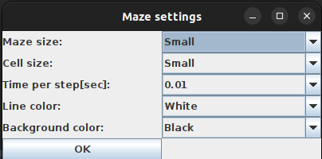
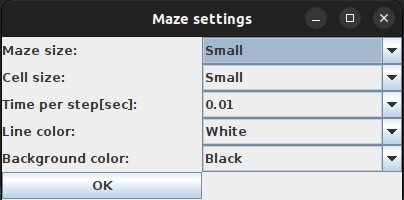
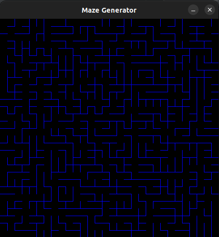
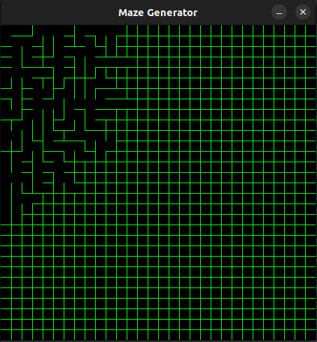

# MazeGenerator

To download
------------
	git clone https://github.com/OpalinskiJakub/MazeGenerator.git
	
To compile
------------
	mvn package

To start
------------
	mvn exec:java

------------

